# RICA: A Real-Time Intelligent Coding Assistant for Detecting Architectural Violations, Design-Pattern Misuse, and Business-Logic Issues During Development

Final Year Individual Project Report

Student Name: H. M. G. C. A. Herath  
Student ID: 11553  
Degree Programme: BSc (Hons) in Software Engineering  
Faculty: Faculty of Computer Science and Engineering  
Institution: KIU  
Supervisor: Mr. Eranga Thennakoon  
Submission Date: 26 August 2026

---

## Declaration

I declare that this dissertation is my own work and that all sources used in the preparation of this report have been acknowledged through appropriate IEEE referencing. This work has not been submitted previously for any other academic award.

Signature: ______________________  
Date: 26 August 2026

---

## Acknowledgement

I would like to express my sincere gratitude to my supervisor for the guidance, feedback, and encouragement provided throughout the project. I also thank the academic staff of the Faculty of Computer Science and Engineering for their support during the Final Year Project module. Finally, I thank my family and peers for their patience and encouragement during the design, implementation, testing, and documentation of this project.

---

## Abstract

Modern Java applications often begin with a clear architectural structure, but that structure can gradually decay as the system grows. Controllers may start accessing repositories directly, business logic may move into API resources, entities may become passive data holders, package boundaries may become blurred, and design-pattern opportunities may be missed. These problems are difficult to identify manually because architectural erosion usually emerges across multiple files rather than inside a single isolated method. Traditional syntax-level linters are useful for formatting and local code smells, but they do not always provide focused, developer-friendly feedback about layered architecture, dependency direction, API boundaries, and design-pattern violations.

This project presents RICA, a Visual Studio Code extension for real-time intelligent code architecture analysis in Java projects. RICA parses Java source files into Abstract Syntax Tree based representations, classifies architectural layers, builds dependency information, and applies deterministic violation rules to detect issues in controllers, services, entities, API resources, cross-file dependencies, package boundaries, and design-pattern usage. The tool reports violations directly inside VS Code using diagnostics with severity levels, rule identifiers, evidence, confidence, explanations, and documentation links. It also includes a dedicated Architecture Violations panel, rule documentation, concept documentation, and incremental revalidation so that edited files can be re-analysed without unnecessarily scanning the whole project on every save.

The final implementation covers local layer rules, API boundary rules, cross-file architecture rules, package boundary checks, and a structured design-pattern rule set. It also supports optional AI-assisted advisory workflows by producing structured diagnostic context that external tools such as GitHub Copilot, Codex, or compatible AI assistants can use to explain or help refactor a violation. The detection pipeline itself remains deterministic and reproducible, while the AI layer is treated as advisory support rather than as the primary source of truth. Testing was performed using unit tests and three representative Java test projects: a clean project, a violation-heavy project, and a structural design-pattern project. The evaluation results show that RICA can detect the expected deterministic rules and provide actionable feedback to developers inside their normal coding environment.

The original proposal described an ambitious system including IFDS-style data-flow analysis, whole-project semantic indexing, real-time IDE feedback, and optional AI reasoning. During implementation, the project was refined into a feasible undergraduate research artefact: a deterministic AST and dependency-graph analyzer with targeted business-logic-adjacent rules, optional AI advisory support, and documented future work for full IFDS data-flow. This refinement preserved the central research contribution: bringing architecture conformance feedback into the developer's editor in a timely, explainable, and usable form.

Keywords: static analysis, Java, software architecture, VS Code extension, layered architecture, Clean Architecture, design patterns, AST, dependency graph, developer tooling

---

## Table of Contents

> This section can be generated automatically in Microsoft Word from the final DOCX headings.

---

## List of Figures

Figure 1.1: Example of architecture erosion in a layered Java project  
Figure 2.1: Dependency direction in layered and Clean Architecture  
Figure 3.1: Proposed RICA system architecture  
Figure 3.2: RICA static analysis pipeline  
Figure 3.3: Incremental revalidation workflow  
Figure 4.1: VS Code command palette commands provided by RICA  
Figure 4.2: Inline diagnostic warning produced by RICA  
Figure 4.3: Architecture Violations panel  
Figure 4.4: Violation documentation page with before, after, and diff explanation  
Figure 4.5: Rule concept map and learning documentation  
Figure 5.1: Test project structure used for evaluation  
Figure 5.2: Sample test execution output

---

## List of Tables

Table 1.1: Project aims and objectives  
Table 2.1: Comparison of related static analysis tools  
Table 3.1: Main detector categories in RICA  
Table 4.1: RICA violation code categories  
Table 4.2: VS Code commands and their purpose  
Table 5.1: Unit testing summary  
Table 5.2: Test project evaluation summary  
Table 5.3: Deterministic rule coverage summary  
Table 6.1: Objectives achieved and evidence

---

# Chapter 1 - Introduction

## 1.1 Background

Software architecture defines the high-level organisation of a software system. It describes how responsibilities are divided, how modules depend on each other, and how the system can evolve without becoming difficult to maintain. In Java enterprise development, common architectural styles include layered architecture, Clean Architecture, and ports-and-adapters architecture. These styles usually separate responsibilities into layers such as presentation, application, domain, infrastructure, repositories, and API resources. When this separation is respected, the system becomes easier to test, modify, understand, and extend.

In practice, however, architecture is not protected automatically. A Java project may begin with a clean design, but over time developers may introduce shortcuts. A controller may directly instantiate a service or repository. A service may contain too many responsibilities. A domain entity may become an anemic data container. API resources may expose internal entity classes. An inner layer may import an outer framework detail. A design pattern may be needed but not applied, causing repeated conditionals, scattered state checks, duplicated algorithms, or hardcoded infrastructure calls. These problems are examples of architecture violations or architecture erosion.

Architecture erosion is especially challenging because it often appears gradually. Individual code changes may look small, but their combined effect can weaken the design. Standard compiler checks do not detect these problems because the code may still compile and execute correctly. General-purpose linters can detect formatting issues, unused imports, and some code smells, but they are usually not focused on project-specific architectural boundaries. Therefore, developers need tools that can inspect Java code structurally, understand layer responsibilities, and provide actionable feedback inside the development environment.

RICA was developed to address this problem. It is a Visual Studio Code extension that analyses Java projects for architecture, layer, API boundary, dependency graph, package boundary, and design-pattern violations. The tool provides real-time or on-demand feedback using VS Code diagnostics and a dedicated Architecture Violations panel. Rather than only telling the developer that a rule was broken, RICA aims to explain why the issue matters, what evidence caused the detection, and how the developer can approach the fix.

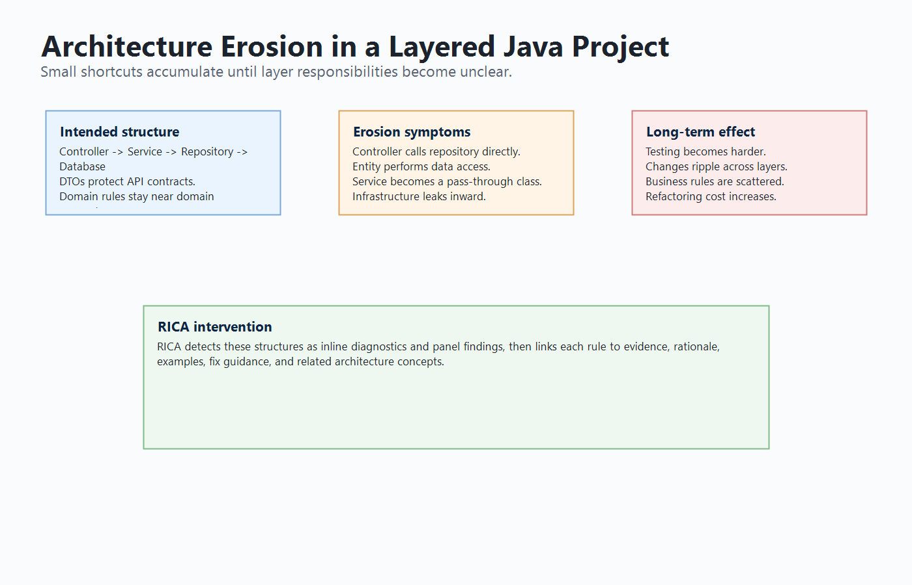

## 1.2 Problem Statement

Many Java projects suffer from architectural decay because architecture rules are often documented informally but not enforced continuously during development. Developers may only discover architectural problems during code review, manual inspection, or late-stage refactoring. This creates several issues:

- Violations are detected late, when they are more expensive to fix.
- Developers may not understand why a particular structure is harmful.
- Existing tools may focus on local syntax or generic quality checks rather than architectural intent.
- Architectural knowledge may remain in documentation instead of being connected to the code editor.
- AI coding assistants may suggest fixes without having precise project-specific violation context.

The problem addressed by this project is therefore:

How can a developer-facing tool analyse Java source code in VS Code and provide timely, explainable, and actionable feedback about architecture and design-pattern violations?

## 1.3 Aim

The aim of this project is to design and implement RICA, a VS Code extension that performs intelligent static analysis of Java projects to detect architecture, layer, API boundary, dependency graph, package boundary, and design-pattern violations, and to present the results in a developer-friendly form with supporting documentation and remediation guidance.

## 1.4 Objectives

Table 1.1 summarises the main objectives of the project.

| Objective | Description |
|---|---|
| O1 | Parse Java source files and extract structural information needed for architectural analysis. |
| O2 | Detect common layered architecture violations in controllers, services, entities, and API resources. |
| O3 | Build cross-file dependency information to detect project-level dependency violations. |
| O4 | Detect package boundary violations according to configurable layer rules. |
| O5 | Detect selected design-pattern and best-practice violations using deterministic heuristics. |
| O6 | Display violations inside VS Code using inline diagnostics and a dedicated panel. |
| O7 | Provide developer-friendly documentation that explains triggers, examples, fixes, and related concepts. |
| O8 | Improve responsiveness using incremental revalidation for edited files. |
| O9 | Support optional AI-assisted remediation by producing structured violation context usable by external AI tools. |
| O10 | Evaluate the implementation using unit tests and representative Java test projects. |

## 1.5 Scope

The scope of RICA is focused on Java source-code analysis inside Visual Studio Code. The implementation analyses `.java` files, extracts AST-based facts, classifies layers, and applies deterministic rules. The tool is not intended to replace a compiler, full semantic type checker, or enterprise architecture governance process. Instead, it provides early feedback to developers while they work.

The implemented scope includes:

- Java AST extraction using a parser-based approach.
- Local layer checks for service, controller, entity, and API resource classes.
- Cross-file dependency analysis using a project dependency graph.
- Configurable package boundary checking.
- Design-pattern and best-practice violation detection.
- VS Code diagnostics and Architecture Violations panel.
- Bundled documentation for rule explanations and concepts.
- Incremental revalidation after file edits.
- Optional AI advisory support through structured diagnostic context.
- Unit tests and deterministic test project evaluation.

The project does not claim to perform perfect semantic analysis for all Java language features. It also does not claim that AI-generated fixes are always correct. AI support is positioned as an optional assistance layer, while deterministic static analysis remains the core detection mechanism.

## 1.6 Alignment with the Original Proposal

The original proposal defined RICA as a real-time intelligent coding assistant for detecting architectural violations, design-pattern misuse, and business-logic issues during development. It described a modular system containing an IDE extension, parser, semantic index, rule engine, data-flow analysis component, issue aggregator, documentation or suggestion layer, and optional AI reasoning. The final implementation remains aligned with the central intention of this proposal, but some elements were refined during development to match the available time, implementation risk, and evaluation feasibility of an undergraduate individual project.

The strongest implemented areas are real-time IDE integration, AST-based Java structure extraction, deterministic rule detection, dependency graph analysis, package boundary checking, design-pattern detection, documentation, and incremental revalidation. These directly support the proposed aim of giving developers early feedback inside VS Code. The implementation also supports the proposed AI direction by exposing structured diagnostic context and an optional advisory pipeline, but it does not depend on AI for core violation detection. This makes the system more reliable and easier to evaluate because deterministic rules can be tested repeatedly with the same expected output.

The main proposed element that remains future work is full IFDS-based data-flow analysis. The proposal discussed interprocedural call graphs and data-flow graphs for tracking business-logic constraints such as missing authorization checks. The final implementation includes selected business-logic-adjacent checks, such as business logic in controllers/resources, raw database access, direct HTTP calls, missing validation, and AI advisory probes. However, it does not implement a mathematically complete IFDS solver. This is presented honestly as a limitation and future work rather than as a completed feature.

This alignment is important for the final defence. The project should be defended as a successful implementation of the core architecture-analysis and IDE-feedback vision, with the deeper IFDS and formal benchmark evaluation treated as extensions beyond the completed prototype. This is academically acceptable because the final artefact demonstrates the central research idea and provides a working basis for future semantic analysis.

## 1.7 Significance of the Project

The significance of RICA is that it connects architectural knowledge directly to the developer's coding environment. Instead of expecting developers to manually compare code against architectural guidelines, RICA highlights issues in context and links each violation to documentation. This can improve awareness, reduce late-stage refactoring cost, and support architectural consistency across Java projects.

RICA is also significant from a research perspective because it combines several ideas into one developer-facing tool: AST-based static analysis, dependency graph analysis, deterministic rule detection, incremental revalidation, documentation generation, and AI-ready diagnostic context. The project demonstrates how architecture rules can be operationalised as practical development feedback rather than remaining only as theoretical guidelines.

From an industry perspective, RICA reduces the distance between rule violation and correction. From an educational perspective, it connects diagnostics to explanations of Clean Architecture, dependency direction, infrastructure, repositories, DTOs, design patterns, and rule tuning.

## 1.8 Report Structure

This report is organised into six chapters. Chapter 1 introduces the background, problem, aim, objectives, scope, and significance of the project. Chapter 2 reviews relevant literature and related tools. Chapter 3 explains the methodology and system design. Chapter 4 describes the implementation of RICA. Chapter 5 presents testing and evaluation. Chapter 6 concludes the report and discusses future work.

# Chapter 2 - Literature Review

## 2.1 Introduction

This chapter reviews the concepts and tools relevant to RICA. The review focuses on software architecture erosion, layered architecture, Clean Architecture, static analysis, AST-based analysis, dependency graph analysis, design patterns, developer documentation, and AI-assisted software engineering.

## 2.2 Software Architecture and Architecture Erosion

Software architecture provides the organising structure of a system. It defines components, responsibilities, and dependencies. Good architecture supports maintainability, testability, modifiability, and understandability. However, architecture can erode when implementation decisions no longer match the intended design. This can happen when developers introduce shortcuts, when requirements change quickly, or when architectural rules are not enforced consistently.

Architecture erosion is dangerous because it is often invisible at compile time. For example, a controller directly accessing a repository may compile successfully, but it violates the intended separation between presentation and data access. A service class with multiple unrelated responsibilities may pass tests, but it becomes harder to maintain. A domain layer importing infrastructure details may work at runtime, but it breaks dependency direction and makes the domain harder to reuse or test.

Tools such as architecture fitness functions and static analysis can help detect erosion earlier. RICA follows this direction by encoding selected architecture expectations as static analysis rules and showing violations during development.

## 2.3 Layered Architecture

Layered architecture separates a system into horizontal layers. A common Java web application may contain presentation controllers, application services, domain models, repositories, and infrastructure components. Each layer has a responsibility:

- Presentation layer handles inbound requests and responses.
- Application/service layer coordinates use cases.
- Domain layer represents business rules and core concepts.
- Repository or infrastructure layer handles persistence, external services, files, and frameworks.
- API resource layer defines external contracts such as DTOs and REST resources.

The main principle is that each layer should depend only on allowed layers. If dependencies move in the wrong direction, changes in one layer can affect unrelated parts of the system. RICA uses this principle to detect violations such as controller bypass, cross-layer violation, entity exposure, and package boundary violation.

## 2.4 Clean Architecture and Dependency Direction

Clean Architecture emphasises that source-code dependencies should point inward toward policies and domain rules, while frameworks and infrastructure should remain outside the core. The Dependency Rule states that inner layers should not depend on outer layers. For example, domain or application code should not directly depend on presentation controllers or concrete infrastructure frameworks.

RICA applies this idea through package boundary checks and graph-based dependency rules. The package boundary detector compares package patterns against configured layers and allowed dependencies. If an application-layer file imports a presentation-layer class, RICA can report a violation with evidence such as the exact import statement. This makes abstract architecture principles visible in the editor.

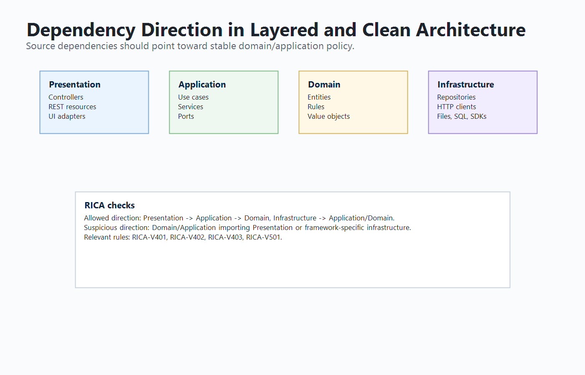

## 2.5 Static Code Analysis

Static code analysis examines source code without executing it. It can identify syntax issues, style problems, security vulnerabilities, complexity, duplication, dependency violations, and architectural problems. Static analysis is valuable because it can provide feedback early in the development lifecycle.

Existing static analysis tools such as Checkstyle, PMD, SonarQube, and SpotBugs provide useful checks for Java projects. However, these tools may not always provide fine-grained, project-specific architectural feedback inside the developer's immediate editor workflow. RICA focuses specifically on architecture and design-pattern guidance for Java projects in VS Code.

Static analysis techniques vary in depth. Simple syntax-based rules detect surface patterns such as banned imports or obvious API misuse, while deeper program analysis models data flow, control flow, call chains, aliasing, and object states. RICA uses a pragmatic middle ground: it extracts the structural facts most relevant to architecture conformance while remaining fast enough for editor feedback.

This approach is supported by the history of practical static bug detection. Tools such as FindBugs and SpotBugs show that simple, well-designed detectors can find meaningful defects in real systems. The value of such tools does not come from perfect completeness, but from detecting frequent and important problems with low friction. RICA follows the same philosophy for architectural defects: it targets recognisable structures that often indicate real maintainability problems.

## 2.6 AST-Based Program Analysis

An Abstract Syntax Tree represents source code as structured syntax. AST-based analysis is more reliable than plain text matching because it can identify classes, methods, fields, annotations, imports, method calls, object creation expressions, and other program elements. RICA uses AST-derived information to classify Java classes and detect rule triggers.

For example, detecting direct service instantiation requires identifying `new ServiceName()` expressions inside a controller. Detecting missing validation requires inspecting API resource method parameters and annotations. Detecting package boundary violations requires imports and package names. Detecting design-pattern opportunities may require method calls, object creations, complexity metrics, inheritance, or interface usage.

AST analysis is particularly suitable for RICA because most rules are structural. A plain text search for `Repository` would be unreliable because the word could appear in comments or string literals. AST analysis can determine whether a repository appears as a field type, constructor parameter, object creation, import, return type, or method call target. Some Java features remain difficult without full compiler type resolution, so RICA combines AST extraction with framework-aware filters and configuration.

## 2.7 Dependency Graph Analysis

Some architecture violations cannot be detected accurately by analysing one file in isolation. A controller may depend on a repository through a field, import, or method call. A cycle may involve two or more classes. Entity exposure may require knowing whether a returned type belongs to the domain layer. Dependency graph analysis represents classes or files as nodes and relationships as edges. This allows project-level analysis.

RICA builds and updates dependency information from parsed Java files. The cross-file analyzer uses this information to detect controller bypass, cross-layer violations, cyclic or inverted dependencies, and entity exposure.

Dependency graphs also support incremental revalidation. If a class changes, RICA can identify files that depend on the changed file and revalidate the affected area instead of blindly scanning the whole project. To avoid stale results, the implementation maintains bidirectional dependency and dependent maps.

## 2.8 IFDS and Data-Flow Analysis

The original proposal referred to IFDS-style data-flow analysis. IFDS is a framework for solving interprocedural finite distributive subset problems by representing data-flow analysis as graph reachability. It is used in advanced static analysis research because it can model how information flows through procedure calls and across method boundaries. Tools such as FlowDroid demonstrate that context-sensitive and flow-sensitive analysis can be effective for detecting security-related flows in specific environments.

For RICA, IFDS is relevant because some business-logic violations are not visible from local structure alone. For example, detecting whether every state-changing method has a permission check may require tracing a request from controller to service to repository. A simple AST check may detect that a repository write exists, but it may not prove whether authorization was performed earlier in the call chain.

The final RICA implementation does not include a complete IFDS solver. This decision was made because implementing and validating a precise data-flow engine would significantly increase scope, complexity, and evaluation requirements. Instead, RICA implements a practical first stage: AST facts, dependency graph analysis, rule-based architectural checks, selected business-logic-adjacent rules, and optional AI advisory context. This still supports the research aim of real-time architecture assistance, while leaving full IFDS analysis as a clear future extension.

## 2.9 Design Patterns and Best Practices

Design patterns describe reusable solutions to recurring design problems. Creational patterns help with object creation, structural patterns help organise relationships between classes, and behavioral patterns help organise algorithms and interactions. However, a missing or misapplied pattern can lead to code smells such as duplicated conditionals, hardcoded construction, scattered state logic, service locators, fat interfaces, or raw thread creation.

RICA includes deterministic design-pattern rules from `RICA-V301` to `RICA-V323`. These rules are not intended to force design patterns everywhere. Instead, they identify code structures where a design pattern may reduce coupling, duplication, or responsibility leakage. The documentation includes explanations and examples so that developers can judge whether the finding is a real violation or a case requiring rule tuning.

A design-pattern detector must be treated differently from a syntax error detector. There is rarely one line that proves a pattern is required. RICA therefore looks for symptoms such as repeated branching, complex construction, scattered state checks, duplicated algorithms, or direct heavy resource creation. Many of these findings are warnings rather than errors because the developer must decide whether the pattern improves the design.

## 2.10 Developer-Friendly Documentation

A static analysis tool is more useful when developers understand its findings. If a tool reports a violation without context, the developer may ignore it or apply an incorrect fix. RICA therefore includes rule documentation with the following structure:

- What triggers the rule.
- Why the rule matters.
- Violating example.
- Fixed example.
- Highlighted diff.
- Common framework cases.
- How to fix.
- How to verify.
- Related concepts.

This documentation is important for the educational value of the project. It supports both code correction and learning.

The documentation design also addresses a practical issue discovered during development: architecture terms are not always obvious to every developer. A rule page may say "move this to infrastructure" or "invert the dependency", but that advice is only useful if the developer understands infrastructure, dependency inversion, ports, adapters, repositories, DTOs, and API contracts. Therefore, RICA includes concept documentation and a rule-concept map. A developer can move from a violation page to the relevant background concept, understand the architectural reason, and then return to the fix guidance.

This makes RICA more than a warning generator. It becomes a learning-oriented development tool. The documentation helps prevent shallow fixes such as suppressing a rule, moving code randomly, or adding another layer dependency just to remove an error. Instead, the developer is guided toward a design correction that preserves the architecture.

## 2.11 AI-Assisted Software Engineering

AI coding assistants such as GitHub Copilot, Codex, and other IDE-based tools can help developers explain code, generate refactoring suggestions, and implement changes. However, AI tools are more reliable when they receive precise context. A generic prompt such as "fix this architecture" is less useful than a diagnostic that includes a rule code, evidence, affected file, line number, confidence, and documentation link.

RICA's approach is to keep violation detection deterministic while exposing structured context that can be used by optional AI-assisted workflows. This means RICA acts as the architecture analysis and evidence provider. External AI tools can act as remediation assistants when the developer chooses to use them. This separation improves defensibility because the static analysis results are reproducible, while AI output remains advisory.

The literature on AI coding assistants shows both promise and risk. AI can improve productivity, but generated suggestions still require review, especially for architecture and business-logic issues. RICA reduces this risk by first defining the violation through deterministic evidence and then treating AI as optional advisory support.

## 2.12 Related Tools

Table 2.1 compares RICA with selected related tools.

| Tool | Main focus | Relation to RICA |
|---|---|---|
| Checkstyle | Coding style and conventions | Useful for style enforcement, but less focused on architecture guidance. |
| PMD | Code quality and rule-based analysis | Similar rule-based idea, but RICA focuses on architecture and VS Code diagnostics. |
| SpotBugs | Bytecode-level bug detection | Detects potential bugs, while RICA focuses on architectural structure. |
| SonarQube | Quality gates, smells, security, duplication | Broad analysis platform, while RICA is lightweight and editor-integrated. |
| ArchUnit | Architecture tests for Java | Strong for test-based architecture rules, while RICA gives editor-time feedback. |
| GitHub Copilot / Codex | AI coding assistance | Can use RICA diagnostics as structured context for explanation and fixing. |

## 2.13 Research Gap

The gap addressed by this project is the need for a developer-friendly VS Code extension that provides architecture-focused static analysis for Java projects and connects each finding to practical remediation guidance. RICA contributes by combining deterministic AST analysis, dependency graph analysis, configurable layer boundaries, design-pattern detection, inline diagnostics, documentation, and optional AI-ready context.

# Chapter 3 - Methodology and Design

## 3.1 Introduction

This chapter describes the methodology and design of RICA. The project follows an applied software engineering research approach. The problem was identified through the need to detect architecture violations in Java projects. A tool was designed, implemented, and evaluated using controlled test projects and automated tests.

## 3.2 Research Methodology

The project followed these stages:

1. Problem identification and literature review.
2. Requirement analysis for architecture violation detection.
3. Design of a VS Code extension architecture.
4. Design of Java AST extraction and rule detection pipeline.
5. Implementation of local, cross-file, package boundary, and design-pattern detectors.
6. Implementation of diagnostics, panel UI, documentation, and configuration.
7. Implementation of incremental revalidation for responsiveness.
8. Testing using unit tests and representative Java projects.
9. Evaluation against objectives and limitations.

This methodology is appropriate because the project is both research-oriented and implementation-oriented. It requires understanding architecture principles and demonstrating them through a working software artefact.

The methodology can be described as design science research because the project produces and evaluates an artefact. The artefact is the RICA extension and its supporting analysis engine. The research problem is practical, but it is grounded in academic concepts such as software architecture erosion, static analysis, dependency graphs, design patterns, and AI-assisted software engineering. The value of the project is demonstrated by showing that the artefact can detect a defined set of violations and present them in a useful development environment.

The project also followed an iterative development process. Early work focused on parsing Java source files and extracting the minimum information required for layer analysis. Later iterations added more detector categories, cross-file graph reasoning, package boundary rules, design-pattern checks, diagnostic metadata, documentation, and incremental revalidation. This iterative approach was necessary because architecture violation detection is highly dependent on the quality of extracted program facts. Each new detector exposed parser limitations or false-positive cases, which were then converted into regression tests.

During implementation, scope was continuously evaluated against feasibility. The proposal discussed a Java core engine, IFDS-style data-flow, open-source benchmark comparisons, and optional AI reasoning. The final implementation prioritised the features most central to the user-facing research contribution: a working VS Code extension, deterministic architecture analysis, project-wide dependency reasoning, design-pattern detection, documentation, and AI-ready diagnostic context. The IFDS component and large-scale external benchmark remain future work, while the completed system provides the foundation required to add them later.

## 3.3 System Overview

RICA is implemented as a VS Code extension. It activates when a Java workspace is opened or when a RICA command is executed. The extension parses Java files, stores AST information, runs analyzers, reports diagnostics, and displays violations in a webview panel.

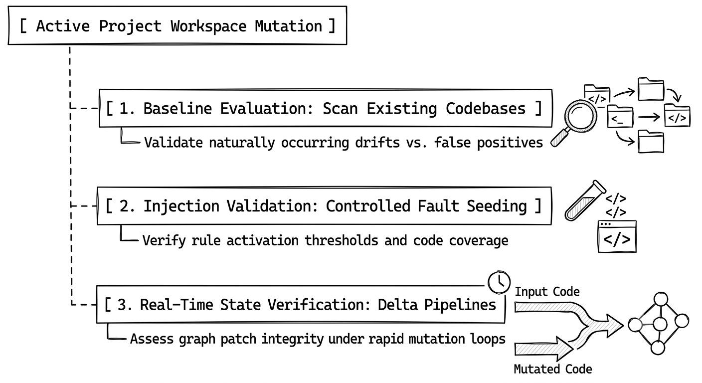

The final architecture consists of five main areas. The first area is the presentation and IDE integration layer. This includes the extension activation logic, command registration, status view, diagnostics, and webview panels. The second area is the parser and source provider layer, which reads Java source code and converts it into structured AST output. The third area is the analysis core, including the violation manager, dependency graph, impact analyzer, and detector modules. The fourth area is the documentation layer, which maps violation codes to generated rule pages and concept pages. The fifth area is the optional AI advisory layer, which can reason over selected findings without replacing deterministic analysis.

This separation improves maintainability. The parser can evolve without rewriting the UI. The detectors can be tested independently. The documentation can be regenerated from a single catalogue. The AI advisory path can be disabled without affecting deterministic analysis. This directly supports the proposal's requirement for a modular architecture suitable for IDE-based use.

## 3.4 Analysis Pipeline

The analysis pipeline consists of the following steps:

1. Discover Java files in the workspace.
2. Exclude generated, build, dependency, and test paths using configured patterns.
3. Parse each Java file into structured AST output.
4. Classify classes by annotations, package names, and type information.
5. Extract imports, fields, methods, annotations, calls, object creations, and relationships.
6. Build dependency graph information.
7. Run local layer analyzers.
8. Run API resource analyzer.
9. Run cross-file analyzer.
10. Run package boundary analyzer.
11. Run design-pattern analyzer.
12. Enrich violations with documentation, mitigation, evidence, confidence, and metadata.
13. Report diagnostics and update the Architecture Violations panel.

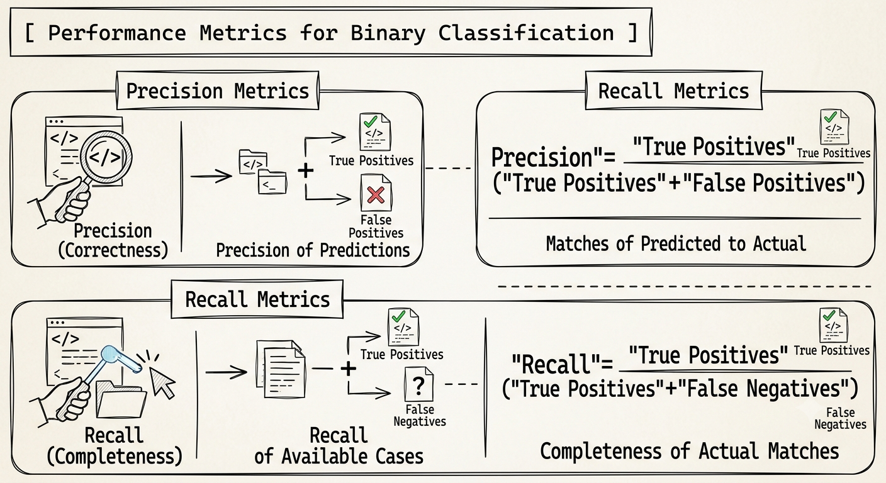

The pipeline is designed around a central `ViolationManager`. This component acts as the coordinator between parsing, graph construction, detector execution, violation merging, diagnostic reporting, and webview updates. The manager stores the latest AST cache for the workspace. This cache is important because cross-file rules and incremental revalidation require knowledge of the previous and current state of each file.

The pipeline uses a unified violation model so that detector-specific results can be displayed, documented, and tested consistently. The deterministic pipeline is kept separate from optional AI advisory output because deterministic results are easier to reproduce and evaluate.

## 3.5 Detector Categories

Table 3.1 shows the main detector categories.

| Detector category | Purpose | Example codes |
|---|---|---|
| Service layer detector | Detects service responsibility and dependency violations. | RICA-V101, V102, V104 |
| Controller layer detector | Detects controller business logic and direct infrastructure access. | RICA-V103, V106, V110 |
| Entity layer detector | Detects entity-layer responsibility violations. | RICA-V107, V108, V109 |
| API resource detector | Detects API boundary and validation problems. | RICA-V201 to V207 |
| Cross-file analyzer | Detects dependency graph problems. | RICA-V401 to V404 |
| Package boundary analyzer | Detects configurable package dependency violations. | RICA-V501 |
| Design-pattern analyzer | Detects selected design-pattern and best-practice issues. | RICA-V301 to V323 |
| AI advisory module | Adds optional advisory findings or reasoning context. | RICA-V000 |

## 3.6 Violation Data Model

Each violation is represented with structured information. A violation can include:

- Rule name.
- Rule code.
- Severity.
- Message.
- File path.
- Line number.
- Diagnostic range.
- Mitigation hint.
- Explanation.
- Context metadata.
- Analysis metadata.
- Documentation URL.
- Detector source.

The analysis metadata is important for explainability. It includes confidence, evidence, reason, and violation type. For example, a package boundary violation can show evidence such as `import com.foo.presentation.UserController`, a reason such as `application layer depends on presentation layer`, and a type such as `Architecture best-practice violation`.

This metadata addresses one of the main weaknesses of many static analysis tools: unclear feedback. RICA aims to answer four questions:

1. What rule was triggered?
2. Where did it happen?
3. What evidence caused the detector to report it?
4. What should the developer read or change next?

The evidence field is especially useful for package boundary and dependency violations because it can show the exact import, reference, or source relationship. The confidence field helps communicate whether the finding is highly deterministic or more heuristic. The violation type field helps group findings into architecture best-practice violations, design-pattern best-practice violations, API boundary issues, and advisory findings.

The violation model also supports remediation suggestions. In simple cases, RICA can present a safe quick-fix style suggestion. In architecture-heavy cases, the suggestion is intentionally manual because extracting a gateway, introducing a strategy, or splitting a service class requires domain judgement.

## 3.7 Incremental Revalidation Design

A full project scan after every small edit can make an editor extension feel slow. RICA therefore uses incremental revalidation. When a file is saved, the previous AST and new AST are compared using semantic fact groups:

- public signature
- class structure
- imports
- relationships
- method calls
- object creations
- fields
- annotations
- method complexity
- suppressions

Only detector families affected by the changed facts are re-run. For example, if object creation changes, object-creation-related design-pattern rules such as raw thread spawn or leaking construction logic may be re-run. If imports change, package boundary and dependency graph checks may be re-run. If the file is new or the cache is cold, RICA performs a full update because the project state must be built.

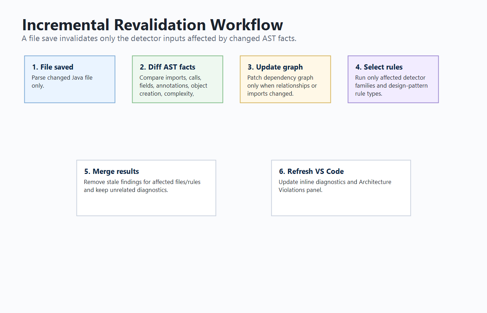

The incremental design is one of the main engineering refinements of the project. A simple implementation could re-analyse the full project on every save. That approach is easier to implement, but it creates a poor editor experience because diagnostics remain stale for longer and the tool feels slow. RICA instead compares old and new AST facts and calculates what kind of analysis is affected.

For example, if a developer only changes a literal value inside a method and the AST facts used by rules do not change, RICA can avoid re-running expensive detectors. If a developer adds `new Thread(...)`, object-creation facts change, so the design-pattern rules related to raw thread creation and construction logic are re-run. If a developer changes imports, package boundary and graph rules are re-run. If a developer changes annotations, package-boundary logic can include dependent files because annotations may change how imported target classes are interpreted.

This design is similar to incremental compilation and reactive UI rendering. The goal is not to update everything blindly, but to update the computations whose inputs changed. This is why the impact analyzer groups facts by detector relevance. It allows RICA to remain responsive without ignoring cross-file correctness.

The final implementation still uses full re-analysis in cases where it is safer. A newly discovered file triggers a full update because the project cache may not yet contain enough context. File deletion also triggers full analysis to avoid stale graph state. This balance is important: performance should improve ordinary edits, but correctness must remain the priority when project shape changes.

## 3.8 AI-Assisted Design

The AI-related design is intentionally separated from deterministic detection. RICA produces structured diagnostics that can be used by external AI tools. It also contains an optional AI advisory configuration where AI reasoning can be enabled as a non-blocking advisory pass. The core design principle is:

> Deterministic rules detect and explain violations; AI assists developers with interpretation or remediation when requested.

This design is defensible because it avoids making unpredictable AI output the only source of rule enforcement. The developer can pass a RICA diagnostic to GitHub Copilot, Codex, or another assistant and ask for an explanation or refactoring suggestion. The AI assistant receives stronger context because RICA has already identified the rule, evidence, affected file, and intended architecture principle.

The proposal described an AI layer for contextual reasoning. In the final system, this is represented as an optional advisory capability and an AI-ready diagnostic model. This is a practical design decision. Architecture violations must be reproducible for testing, so deterministic analysis is used as the foundation. AI can then support ambiguous or explanation-heavy cases.

For example, RICA may report that a controller performs a direct HTTP call. The deterministic rule can identify the framework class or method call that caused the issue. An AI assistant can then use this context to suggest introducing a gateway interface, moving HTTP client details into infrastructure, and updating tests. In this workflow, RICA supplies reliable evidence and the AI helps with developer understanding or code transformation.

This separation also supports ethical and operational requirements. AI can be disabled, external calls are optional, audit logging can record advisory decisions, and deterministic diagnostics remain available even when the AI provider is offline.

# Chapter 4 - Implementation

## 4.1 Introduction

This chapter describes the implementation of RICA. The extension is implemented using TypeScript and JavaScript for Visual Studio Code. The implementation includes extension activation, commands, configuration, Java parsing, AST management, analyzers, diagnostics, webview panels, documentation generation, testing scripts, and optional AI advisory support.

## 4.2 VS Code Extension Implementation

RICA contributes several VS Code commands. Table 4.2 lists the main commands.

| Command | Purpose |
|---|---|
| Java AST: Analyze Full Project | Parses and analyses the full Java workspace. |
| Java AST: Analyze Current File | Analyses the currently active Java file. |
| Java AST: Show Architecture Violations | Opens the violations dashboard panel. |
| Java AST: Show AST Viewer | Opens the AST viewer inside VS Code. |
| Java AST: Open Browser Viewer | Opens the optional browser AST viewer when the backend is available. |
| Java AST: Show Status | Shows status information and quick actions. |
| Java AST: Open RICA Documentation | Opens bundled RICA documentation. |
| Java AST: Reset Backend Data | Clears stored AST and violation state. |

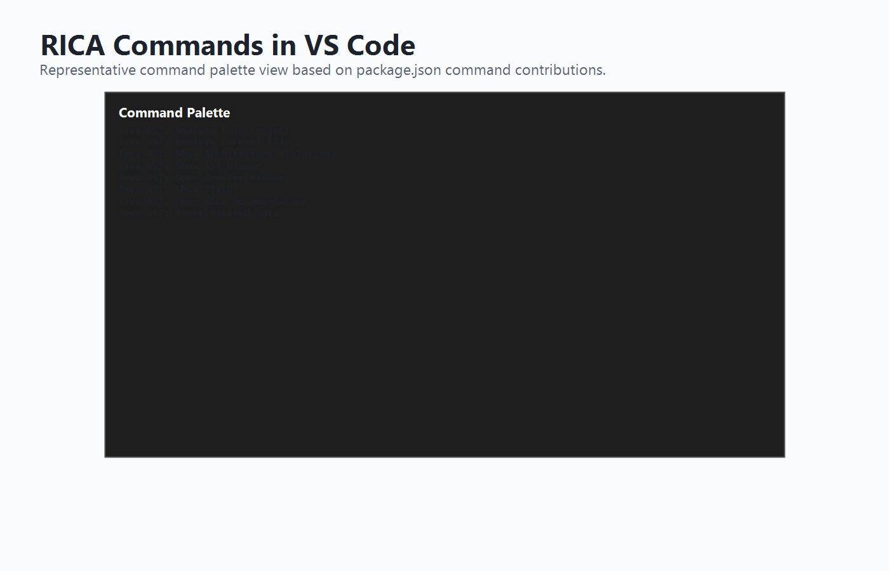

The extension entry point registers commands, configuration handling, diagnostics, and UI panels. Activation events allow RICA to start when a Java workspace is opened or when a command is executed. Automatic analysis on workspace open is configurable through `javaAstAnalyzer.autoAnalyzeOnOpen`, while manual commands remain available for full scans, current-file scans, status inspection, and documentation access.

The VS Code integration is intentionally kept separate from the analysis rules. This means the detector logic can be tested using Mocha unit tests without starting VS Code. It also means that future interfaces, such as an IntelliJ plugin or language-server implementation, could reuse the same analysis concepts with a different presentation layer.

## 4.3 Java Parser and AST Extraction

The parser extracts source-code facts needed by the analyzers. These include package information, imports, classes, annotations, methods, parameters, attributes, method calls, object creations, relationships, and source locations. This information is stored in a structured AST output that can be reused by the violation manager and analyzers.

AST extraction is central to RICA because architecture violations are structural. For example, detecting a missing DTO requires knowing method return types and parameter types. Detecting direct service instantiation requires object creation information. Detecting a package boundary violation requires imports and package names.

The parser also extracts diagnostic locations, including line numbers and ranges where possible, so RICA can underline meaningful source locations. It recognises common Java and Spring structures such as controllers, services, repositories, entities, API resources, dependency injection annotations, constructor injection, setter injection, and selected Lombok annotations. This framework awareness reduces false positives such as incorrectly treating Lombok-generated constructor injection as an uninjected dependency.

The parser does not attempt to replace `javac`. It is designed for fast editor feedback rather than complete compilation. This is why the report presents RICA as an AST-based static analysis tool with practical semantic extraction, not as a full Java compiler or proof engine.

## 4.4 Layer Violation Detectors

RICA includes detectors for service, controller, entity, and API resource layers.

The service layer detector identifies issues such as self-instantiation, uninjected repository access, and anemic services. The controller detector identifies issues such as direct service instantiation, business logic in controllers, direct HTTP calls, raw SQL access, file I/O, background threads, and static caches. The entity detector identifies direct layer access, anemic entities, and improper data access. The API resource detector identifies exposed internal entities, missing DTO usage, improper error handling, business logic in resources, direct service instantiation, missing validation, and exposed internal structure.

These detectors are local because many of their triggers can be found by inspecting a single file. However, their results are still enriched with unified violation metadata before being displayed.

Together, these detectors protect the intended responsibilities of each layer. Services should coordinate use cases without bypassing dependency injection. Controllers should handle inbound requests without performing persistence, file access, raw SQL, thread management, external protocol logic, or complex business decisions. Entities should model domain concepts without depending on repositories or infrastructure. API resources should expose stable contracts using DTOs, validation, and controlled error handling. The detector severities reflect this distinction: clear dependency and infrastructure leaks are usually errors, while design-smell cases such as anemic services or entities are usually warnings or information.

## 4.5 Cross-File Dependency Analysis

The cross-file analyzer uses dependency graph information to detect architecture issues across multiple files. The implemented graph rules include controller bypass, cross-layer violation, cyclic or inverted dependency, and entity exposure. These rules are important because architectural problems often involve relationships between files rather than isolated syntax.

For example, a controller directly depending on a repository can be identified from imports, field types, method calls, or relationships. A cycle requires checking graph edges across multiple classes. RICA reports these issues with rule codes in the `RICA-V401` to `RICA-V404` range.

The graph rules complement local detectors by reasoning about relationships across the project. This helps detect issues such as a controller returning a type that appears harmless locally but resolves to a domain entity, or a cycle that makes modules harder to test and change independently.

## 4.6 Package Boundary Analysis

The package boundary analyzer checks whether a file in one configured architectural layer depends on a disallowed layer. The layer configuration is customisable through VS Code settings. The default layer model includes domain, application, infrastructure, and presentation layers.

For example, if an application-layer class imports a presentation-layer controller, RICA reports `RICA-V501`. The violation includes the source layer, target layer, target component, allowed dependencies, evidence, and explanation. The documentation also explains framework-specific cases such as Spring Data imports, where the correct fix may be to adjust configuration rather than move already-correct repository code.

The package boundary rule is configurable because real projects use different layouts. RICA's default configuration provides a Clean Architecture oriented model, but developers can modify package patterns and allowed dependencies so the detector enforces the team's actual architecture rather than one fixed assumption.

Framework awareness is also important for this rule. Some imports represent framework annotations or repository utilities rather than architecture-level dependency mistakes. For example, Spring Data annotations such as `@Query`, `@Modifying`, or `@Param` may appear in repository code. In such cases, the correct response may be to tune layer configuration or framework allowances rather than move the code. The documentation was refined to make these cases explicit.

## 4.7 Design-Pattern Violation Detection

RICA includes deterministic design-pattern checks from `RICA-V301` to `RICA-V323`. These cover issues such as missing adapter, god facade, missing strategy, missing factory, mutable singleton, raw thread spawn, missing abstraction, leaking construction logic, fat interface, missing command, missing prototype, fragmented factories, missing decorator, missing composite, missing flyweight, scattered state machine, duplicate algorithm, hardcoded notifications, monolithic pipeline, service locator, excessive null checks, missing proxy, and missing bridge.

The analyzer exposes rule-level execution so that incremental revalidation can run only the relevant design-pattern checks after a file edit. This improves editor responsiveness while preserving deterministic detection.

Table 4.1 summarises the RICA rule categories.

| Code range | Category |
|---|---|
| RICA-V101 to RICA-V114 | Layer responsibility and dependency rules |
| RICA-V201 to RICA-V207 | API boundary rules |
| RICA-V301 to RICA-V323 | Design-pattern and best-practice rules |
| RICA-V401 to RICA-V404 | Cross-file architecture graph rules |
| RICA-V501 | Package boundary rule |
| RICA-V000 / fallback codes | Advisory or unmapped fallback findings |

The design-pattern analyzer is implemented as a collection of specific rule checks rather than one generic detector. Each rule maps to a RICA code and documentation page. The analyzer also supports rule-level execution for incremental revalidation, allowing the violation manager to run only the checks affected by changed AST facts.

Design-pattern checks require careful severity decisions. Some findings are reported as errors because they often indicate clear architectural danger, such as raw thread creation or direct framework coupling. Others are warnings because they are design recommendations that require developer judgement. This avoids overclaiming. RICA does not say that every conditional must become a pattern; it says the detected structure may benefit from a known pattern and should be reviewed.

## 4.8 Diagnostic Reporting

RICA reports violations using VS Code diagnostics. Each diagnostic can appear as an underline in the editor and can include severity, message, rule code, and related information. This provides immediate feedback while the developer is editing.

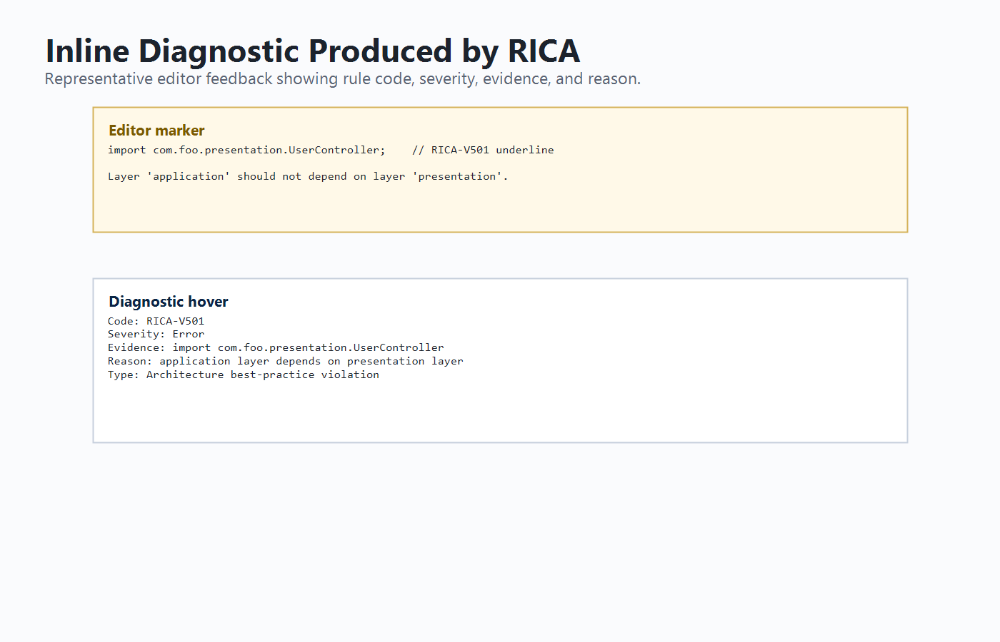

The diagnostic reporter converts RICA violations into VS Code diagnostic objects. Error, warning, and information severities appear naturally beside compiler and linter feedback. Rich context such as evidence, reason, confidence, and violation type helps developers understand findings and gives external AI assistants a structured prompt context.

## 4.9 Architecture Violations Panel

The Architecture Violations panel provides a dashboard view of detected issues. It allows the developer to inspect violations by severity, detector source, file, line, rule code, evidence, and analysis metadata. It also supports opening the relevant source location and opening the documentation for the rule.

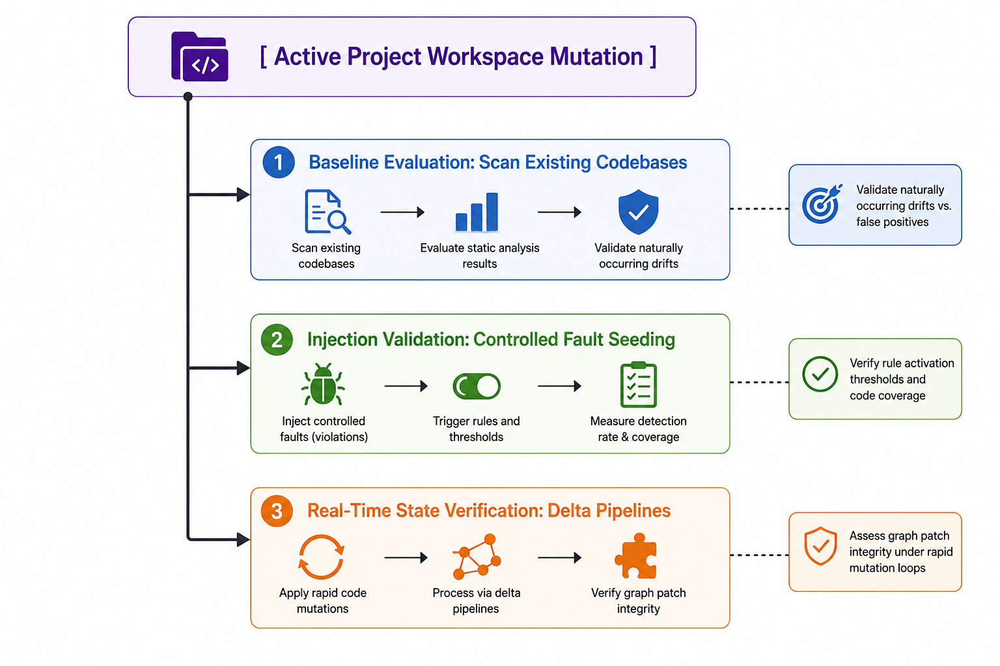

The panel is important because inline underlines alone are not enough for project-level understanding. It acts as a dashboard where developers can inspect severity, detector source, evidence, affected files, and documentation links. Unsafe or unclear automatic fix actions were removed where the correct repair requires design judgement.

## 4.10 Documentation System

RICA includes generated rule documentation under `docs/violations` and concept documentation under `docs/concepts`. Rule pages explain what triggers a violation, why it matters, example code, fixed code, highlighted diff, common framework cases, how to fix, how to verify, and related concepts.

This documentation is important because architecture fixes are not always simple mechanical edits. In many cases, the developer must understand the principle before applying a safe refactor. For example, a package boundary violation caused by Spring framework imports may require configuration or layer-boundary refinement, not a blind movement of code.

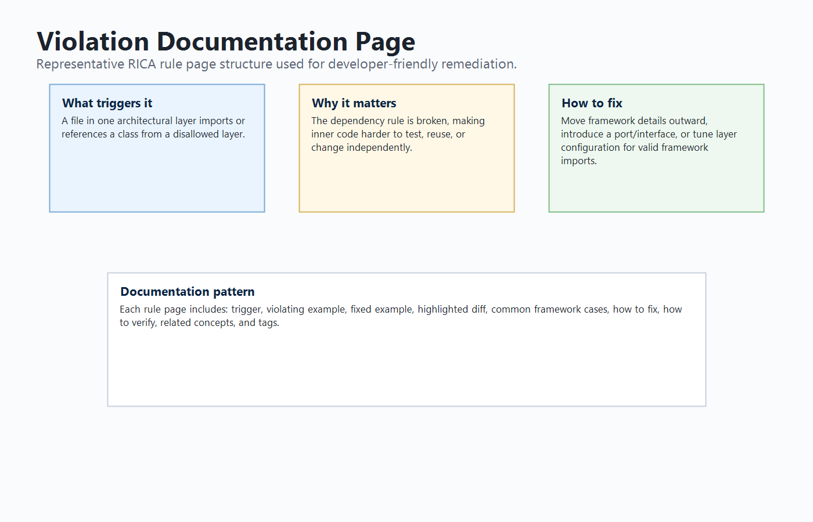

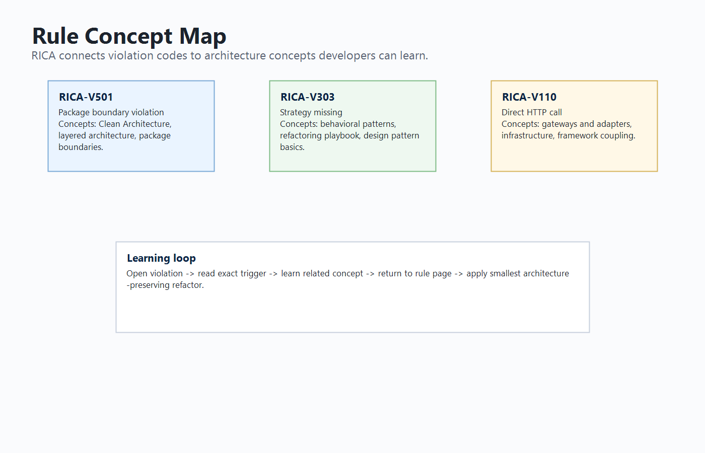

The documentation is generated from a single rule catalogue, reducing drift between analyzer output and rule pages. It includes a rule matrix, rule-concept map, highlighted diffs, design rationale, framework-specific cases, verification steps, and concept pages covering Clean Architecture, layers, dependency injection, DTOs, infrastructure, framework coupling, package boundaries, false positives, and design-pattern categories.

## 4.11 Incremental Revalidation Implementation

The incremental implementation compares old and new AST facts after a file save. If no semantic fact changes, RICA avoids unnecessary re-analysis. If selected facts change, RICA reruns only affected detector families. Local detectors run only for the changed file. Package-boundary checks are revalidated for affected files. Cross-file rules run when graph inputs change. Design-pattern rules are selected by rule type based on changed AST facts.

This implementation improves perceived performance because the extension does not need to perform a full project scan after every ordinary edit. Full scans are still used when required, such as when a new file is discovered or the cache must be rebuilt.

The implementation uses an impact analyzer to classify changes into fact groups. This is more precise than checking only whether a public signature changed, because a method-body edit can introduce a repository call, raw SQL statement, thread creation, or design-pattern smell without changing the public API.

The manager then decides which analysis branches are needed:

- Local layer rules run when local facts such as calls, object creation, fields, annotations, method complexity, or public signatures change.
- Graph rules run when class structure, imports, relationships, or method calls affect dependency edges.
- Package boundary rules run when imports, relationships, class structure, or annotations affect layer classification.
- Design-pattern rules are selected by mapping changed facts to relevant rule types.
- Suppression changes revalidate the affected rule families because a previously hidden finding may need to reappear.

This design keeps diagnostics responsive after normal edits while preserving correctness for cross-file cases. It also provides a strong technical contribution for the final report because it shows that RICA is not a simple batch scanner; it maintains and updates a project model.

## 4.12 Optional AI Advisory Support

RICA's AI-related implementation is designed as an optional advisory layer. The extension configuration includes AI provider settings and an AI review command. The deterministic pipeline remains the primary source of violations. AI can be used to reason about selected candidates, annotate findings, or help produce explanations. In addition, because RICA diagnostics include structured evidence and documentation links, external AI assistants such as GitHub Copilot or Codex can use those diagnostics to generate more relevant explanations or refactoring suggestions.

The final report should defend this as "AI-assisted remediation support" rather than "guaranteed automatic fixing". This distinction is important for academic integrity and technical accuracy.

The AI advisory subsystem contains configuration for provider selection, endpoint, model name, token limit, timeout, candidate limit, trigger mode, and audit logging. The intended workflow is that RICA first detects and structures the violation, then an optional AI provider or external assistant can use the diagnostic context to explain or suggest a refactor. The deterministic result remains visible and auditable.

This implementation satisfies the proposal's AI direction in a scoped and defensible way. The proposal expected an AI layer to resolve ambiguous cases and provide human-readable suggestions. The final system supports that direction, but it clearly labels AI as advisory and avoids claiming that every fix can be generated perfectly.

# Chapter 5 - Testing and Evaluation

## 5.1 Introduction

This chapter presents the testing and evaluation of RICA. The purpose of evaluation is to determine whether the implementation meets the project objectives and whether the detector rules behave as expected on representative Java projects.

## 5.2 Testing Strategy

The testing strategy includes:

- Unit tests for parser behaviour.
- Unit tests for service, controller, entity, and API resource analyzers.
- Unit tests for false-positive regression cases.
- Unit tests for cross-file dependency graph rules.
- Unit tests for design-pattern rules.
- Unit tests for fix suggestion and metadata behaviour.
- Unit tests for incremental revalidation.
- Test project evaluation using three Java project fixtures.

The testing strategy was designed around correctness, false-positive reduction, and regression protection. Positive tests check known bad examples, while negative tests check compliant structures such as proper dependency injection, Lombok constructor injection, simple validation, and framework cases. Incremental tests check that diagnostics do not become stale and that ordinary edits avoid unnecessary full-project analysis.

## 5.3 Unit Test Results

The automated test suite was executed using:

```bash
npm test
```

The latest result was:

```text
157 passing
1 pending
```

The pending test is a parser test for explicit `this.method()` call extraction. It is documented as a remaining parser enhancement and does not invalidate the implemented deterministic rule coverage.

Table 5.1 summarises the unit test result.

| Test group | Result |
|---|---|
| AI advisory tests | Passed |
| Layer analyzer tests | Passed |
| False-positive regression tests | Passed |
| Cross-file analyzer tests | Passed |
| Design-pattern analyzer tests | Passed |
| Parser tests | Passed with one pending enhancement |
| Incremental revalidation tests | Passed |

The unit test result demonstrates that the deterministic analysis pipeline is stable. The tests include parser-level extraction, local detector behaviour, cross-file graph behaviour, design-pattern rule behaviour, fix suggestion behaviour, package-boundary metadata, AI advisory behaviour, and incremental revalidation. This broad coverage is important because the extension is composed of many cooperating modules.

The one pending parser test should be discussed honestly in the final defence. It is not a failed test; it marks a known parser enhancement related to extracting explicit `this.method()` calls. The current implementation still detects many method calls and rule patterns, but this pending item identifies a clear future improvement for more complete Java call extraction.

## 5.4 Test Project Evaluation

The test project verification was executed using:

```bash
npm run test:projects
```

The evaluation used three representative project fixtures:

- `rica-clean`: a clean architecture project expected to produce no violations.
- `rica-violations-heavy`: a project containing many layer, API, cross-file, package, and design violations.
- `rica-structural`: a structural project designed to cover deterministic design-pattern rules.

Table 5.2 summarises the latest test project results.

| Project | Files | Layer | Design Pattern | Cross-File | Package Boundary | Total |
|---|---:|---:|---:|---:|---:|---:|
| rica-clean | 7 | 0 | 0 | 0 | 0 | 0 |
| rica-violations-heavy | 10 | 46 | 4 | 11 | 9 | 70 |
| rica-structural | 41 | 5 | 31 | 0 | 0 | 36 |

The script reported that all expected deterministic rules are covered by the violation test projects.

The clean project checks that RICA can remain quiet when architecture is compliant. The violation-heavy project checks multiple categories together, including layer, design-pattern, cross-file, and package boundary problems. The structural project verifies broad deterministic design-pattern coverage. Together, these fixtures provide controlled evidence for both positive and negative behaviour.

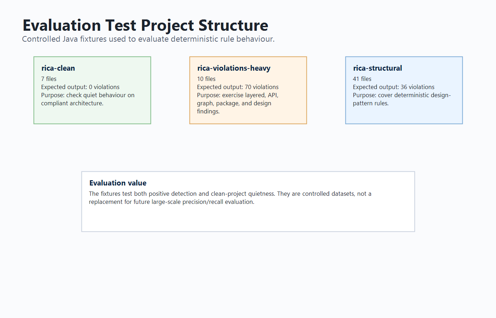

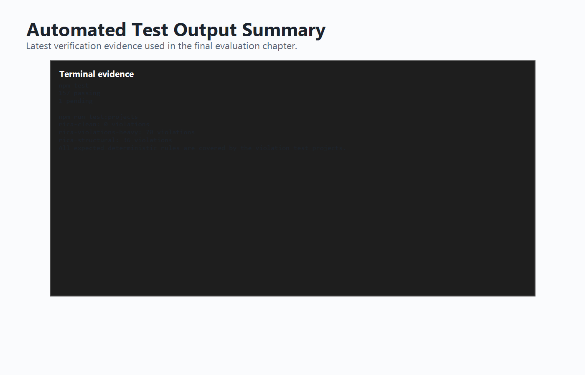

## 5.5 Rule Coverage

The rule coverage includes layer rules, API boundary rules, cross-file rules, package boundary rules, and design-pattern rules. The `rica-structural` test project is particularly important because it covers the deterministic design-pattern rule set from `RICA-V301` to `RICA-V323`.

The rule coverage is organised into code ranges. This improves traceability because every detector output can be mapped to documentation and tests. During development, the rule matrix became a useful quality-control mechanism. If a detector can emit a code, the documentation should include that code. If a rule is documented, the implementation and tests should support it. This helps avoid orphan rules, missing documentation, and unclear findings.

The deterministic test projects currently cover the expected rules, but this should not be described as universal coverage of every possible Java violation. It means that the implemented rule set has representative positive and negative cases. The final defence should state that broader evaluation on open-source projects is a future improvement, especially for measuring precision and recall beyond controlled fixtures.

## 5.6 Evaluation Against Objectives

Table 5.3 maps objectives to evidence.

| Objective | Evidence |
|---|---|
| Java AST extraction | Parser tests and AST-based detector inputs. |
| Layer violation detection | Service, controller, entity, and API analyzer tests. |
| Cross-file dependency detection | Dependency graph and cross-file tests. |
| Package boundary detection | RICA-V501 tests and violation-heavy project output. |
| Design-pattern detection | Design-pattern analyzer tests and structural project coverage. |
| VS Code integration | Commands, diagnostics, and Architecture Violations panel. |
| Documentation | Generated violation pages, concept pages, rule matrix, and rule-concept map. |
| Incremental revalidation | Incremental manager tests and AST fact invalidation implementation. |
| AI-assisted support | Structured diagnostic metadata and optional AI advisory configuration. |
| Evaluation | `npm test` and `npm run test:projects` results. |

The evaluation shows that the central project objectives were achieved. RICA is no longer only a proposed concept; it is a working extension with implemented detector modules and a repeatable test suite. The strongest evidence comes from the automated test results and the test project verification script, because these can be rerun to confirm the same output.

However, some proposal objectives were completed in a scoped form rather than in their most ambitious form. The proposal's full IFDS data-flow analysis and large-scale formal benchmarking were not fully implemented. Instead, the final system includes dependency graph analysis, selected business-logic-adjacent checks, optional AI advisory, and controlled test-project evaluation. This should be presented as an implementation refinement rather than as a failure. The completed work provides the foundation required for those future extensions.

## 5.7 Evaluation Metrics

The final evaluation uses the following practical metrics:

- Rule activation correctness: whether known seeded violations are detected.
- Clean-project quietness: whether a compliant project reports zero violations.
- Rule-code coverage: whether deterministic RICA rule codes are represented by tests or test fixtures.
- Regression stability: whether previously fixed false positives remain fixed.
- Incremental correctness: whether edited files are revalidated without unnecessary full scans.
- Documentation completeness: whether emitted rule codes have documentation pages and concept links.
- Build stability: whether TypeScript compilation and test scripts pass.

Formal precision and recall require a labelled dataset where each violation and non-violation is independently verified. The current project includes controlled fixtures and expected rule outputs, but not a large external labelled benchmark. Therefore, precision and recall are discussed as future formal evaluation metrics rather than as completed empirical claims.

This distinction is important. The project can confidently claim that the implemented tests pass and that expected deterministic rules are covered by the test projects. It should not overclaim that RICA has been proven across all Java projects or that its false-positive rate is universally low.

## 5.8 Limitations

Although RICA meets the main objectives, several limitations remain:

- The parser does not yet fully cover every Java language construct.
- One parser enhancement for explicit `this.method()` call extraction remains pending.
- Some design-pattern rules are heuristic because design intent cannot always be proven statically.
- RICA does not implement full IFDS or interprocedural data-flow analysis.
- Large-scale formal evaluation on external open-source datasets has not yet been completed.
- AI remediation is advisory and depends on external tools or configured providers.
- Automatic fixes are intentionally limited because architecture fixes often require human judgement.

These limitations are acceptable for the current project scope, provided they are explained honestly in the final defence.

## 5.9 Threats to Validity

The evaluation has several threats to validity. First, the test projects are controlled fixtures, so they may not represent the full complexity of industrial Java systems. Second, the analyzer depends on parser extraction quality; unsupported language constructs can affect detection accuracy. Third, design-pattern rules are heuristic, so some findings require developer judgement. Fourth, the project has not yet been evaluated through a formal user study, so usability claims are based on implemented UI features and documentation rather than measured developer outcomes.

These threats do not remove the value of the project, but they define the boundary of the claims. The final report should present RICA as a working and evaluated prototype, not as a universally complete architecture oracle. This is a stronger academic position because it shows awareness of research limitations and future evaluation needs.

# Chapter 6 - Conclusion and Future Work

## 6.1 Conclusion

This project designed and implemented RICA, a real-time intelligent code architecture analyzer for Java projects in Visual Studio Code. The tool addresses the problem of architecture erosion by detecting layer violations, API boundary problems, dependency graph issues, package boundary violations, and selected design-pattern and best-practice problems. RICA uses AST-based static analysis and deterministic rules to produce reproducible results. It presents those results through inline diagnostics, an Architecture Violations panel, and detailed documentation.

The implementation demonstrates that architecture guidance can be integrated directly into the development workflow. Instead of waiting for manual review or late-stage refactoring, developers can receive immediate feedback while editing Java code. The documentation system further improves the tool by explaining not only what is wrong, but why it matters and how to approach a fix.

The project also addresses the "intelligent" aspect by combining rule-based structural analysis, dependency reasoning, severity classification, confidence/evidence metadata, incremental revalidation, and optional AI-assisted advisory workflows. RICA does not rely on AI as the primary detector. Instead, it produces high-quality structured diagnostics that AI tools can use for explanation and remediation support.

## 6.2 Objectives Achieved

The main objectives were achieved. RICA can parse Java files, classify architectural structures, detect deterministic violations, display results in VS Code, provide documentation, support incremental revalidation, and evaluate rule coverage through tests and test projects.

Table 6.1 summarises the achievement of the project objectives.

| Objective | Status | Evidence |
|---|---|---|
| Survey and analyse related tools and techniques | Achieved | Literature review covers static analysis, architecture erosion, design patterns, and AI-assisted development. |
| Design modular RICA architecture | Achieved | VS Code extension, parser, AST cache, dependency graph, detectors, documentation, and AI advisory separation. |
| Implement prototype | Achieved | Working TypeScript VS Code extension and analysis modules. |
| Detect architecture violations | Achieved | Layer, cross-file, and package boundary detectors implemented and tested. |
| Detect design-pattern misuse | Achieved | Deterministic design-pattern rules from RICA-V301 to RICA-V323 implemented and tested. |
| Detect selected business-logic issues | Partially achieved | Business-logic placement, validation, raw access, and AI advisory checks implemented; full IFDS authorization tracing remains future work. |
| Provide IDE feedback | Achieved | Inline diagnostics, command palette commands, and Architecture Violations panel. |
| Provide suggestions/documentation | Achieved | Rule pages, concept pages, rule matrix, and documentation links. |
| Evaluate effectiveness | Partially achieved | Automated tests and synthetic test projects completed; large-scale precision/recall evaluation remains future work. |

## 6.3 Contributions

The main contributions of this project are:

- A working VS Code extension for Java architecture violation detection.
- A unified violation model with severity, evidence, confidence, explanation, and documentation links.
- A deterministic rule set covering layers, API boundaries, package boundaries, cross-file dependencies, and design patterns.
- A developer-friendly Architecture Violations panel.
- Generated rule and concept documentation for learning and remediation.
- Incremental revalidation based on AST fact differences.
- An AI-ready diagnostic model that can support external AI-assisted fixes.

## 6.4 Future Work

Future improvements include:

- Implementing deeper Java semantic analysis and type resolution.
- Completing explicit `this.method()` call extraction.
- Adding IFDS or interprocedural data-flow analysis for more precise security and business-rule checks.
- Performing large-scale evaluation on open-source Java repositories.
- Measuring precision, recall, false-positive rate, and developer usability with formal metrics.
- Improving AI-assisted remediation with controlled prompt templates and validation.
- Adding safer automated refactoring actions for simple cases.
- Publishing the extension to the VS Code Marketplace with complete support documentation.

## 6.5 Final Reflection

RICA demonstrates that architecture analysis can be brought closer to the developer. By combining deterministic static analysis with clear documentation and optional AI support, the tool helps developers identify and understand architecture violations earlier. The project therefore contributes both a practical software tool and an applied research artefact in the area of intelligent developer tooling.

The most important lesson from this project is that "intelligence" in developer tooling does not have to mean that an AI model makes every decision. In RICA, intelligence is achieved through structured analysis, project context, rule classification, evidence generation, incremental revalidation, documentation, and optional AI assistance. This is a more reliable model for architecture tooling because the deterministic rules can be tested and defended, while AI can still improve explanation and remediation support.

---

# References

> These references were aligned with the proposal/interim reference set. Before final submission, verify formatting against the exact university IEEE style sheet.

[1] T. Reps, S. Horwitz, and M. Sagiv, "Precise interprocedural dataflow analysis via graph reachability," in *Conference Record of the Annual ACM Symposium on Principles of Programming Languages*, ACM, 1995, pp. 49-61, doi: 10.1145/199448.199462.  
[2] S. Arzt *et al*., "FlowDroid: Precise context, flow, field, object-sensitive and lifecycle-aware taint analysis for Android apps," *ACM SIGPLAN Notices*, vol. 49, no. 6, pp. 259-269, 2014, doi: 10.1145/2666356.2594299.  
[3] D. Hovemeyer and W. Pugh, "Finding bugs is easy," in *Companion to the 19th Annual ACM SIGPLAN Conference on Object-Oriented Programming Systems, Languages, and Applications*, 2004, pp. 132-136, doi: 10.1145/1028664.1028717.  
[4] K. Etemadi *et al*., "Sorald: Automatic patch suggestions for SonarQube static analysis violations," arXiv:2103.12033, 2021. [Online]. Available: https://arxiv.org/pdf/2103.12033  
[5] R. Just, D. Jalali, and M. D. Ernst, "Defects4J: A database of existing faults to enable controlled testing studies for Java programs," in *Proc. 2014 International Symposium on Software Testing and Analysis*, 2014, pp. 437-440, doi: 10.1145/2610384.2628055.  
[6] L. De Silva and D. Balasubramaniam, "Controlling software architecture erosion: A survey," *Journal of Systems and Software*, vol. 85, no. 1, pp. 132-151, 2012, doi: 10.1016/j.jss.2011.07.036.  
[7] N. Tsantalis, A. Chatzigeorgiou, G. Stephanides, and S. T. Halkidis, "Design pattern detection using similarity scoring," *IEEE Transactions on Software Engineering*, vol. 32, no. 11, pp. 896-909, 2006, doi: 10.1109/TSE.2006.112.  
[8] E. Gamma, R. Helm, R. Johnson, and J. Vlissides, *Design Patterns: Elements of Reusable Object-Oriented Software*. Boston, MA, USA: Addison-Wesley, 1994.  
[9] M. Fowler and K. Beck, *Refactoring: Improving the Design of Existing Code*. Boston, MA, USA: Addison-Wesley, 1999.  
[10] L. Bass, P. Clements, and R. Kazman, *Software Architecture in Practice*, 3rd ed. Boston, MA, USA: Addison-Wesley, 2012.  
[11] M. Alqaradaghi, G. Morse, and T. Kozsik, "Detecting security vulnerabilities with static analysis - A case study," *Pollack Periodica*, vol. 17, pp. 1-7, 2022, doi: 10.1556/606.2021.00454.  
[12] N. Nguyen and S. Nadi, "An empirical evaluation of GitHub Copilot's code suggestions," in *Proc. 2022 Mining Software Repositories Conference*, 2022, pp. 1-5, doi: 10.1145/3524842.3528470.  
[13] B. Yetistiren, I. Ozsoy, M. Ayerdem, and E. Tuzun, "Evaluating the code quality of AI-assisted code generation tools: An empirical study on GitHub Copilot, Amazon CodeWhisperer, and ChatGPT," arXiv, 2023.  
[14] B. Metin, M. Wynn, A. Tunali, and Y. Kepir, "Business logic vulnerabilities in the digital era: A detection framework using artificial intelligence," *Information*, vol. 16, no. 7, 2025, doi: 10.3390/info16070585.  
[15] V. Stray, E. G. Brandtzaeg, V. T. Wivestad, A. Barbala, and N. B. Moe, "Developer productivity with and without GitHub Copilot: A longitudinal mixed-methods case study," in *Proc. 59th Hawaii International Conference on System Sciences*, 2025.  
[16] E. Evans, *Domain-Driven Design: Tackling Complexity in the Heart of Software*. Boston, MA, USA: Addison-Wesley, 2003.  
[17] OWASP Foundation, "OWASP Top 10 for Business Logic Abuse," 2025. [Online]. Available: https://owasp.org/www-project-top-10-for-business-logic-abuse/  
[18] OWASP Foundation, "OWASP Web Security Testing Guide." [Online]. Available: https://owasp.org/www-project-web-security-testing-guide/  
[19] Microsoft, "Visual Studio Code Extension API." [Online]. Available: https://code.visualstudio.com/api  
[20] ArchUnit, "ArchUnit user guide." [Online]. Available: https://www.archunit.org/userguide/html/000_Index.html  
[21] SonarSource, "SonarQube documentation." [Online]. Available: https://docs.sonarsource.com/sonarqube/  

---

# Appendices

## Appendix A - RICA Command List

- Java AST: Analyze Full Project
- Java AST: Analyze Current File
- Java AST: Show Architecture Violations
- Java AST: Show AST Viewer
- Java AST: Open Browser Viewer
- Java AST: Show Status
- Java AST: Open RICA Documentation
- Java AST: Reset Backend Data

## Appendix B - Build and Test Commands

```bash
npm install
npm run compile
npm test
npm run test:projects
npm run docs:verify
npm run docs:build
npx vsce package
```

## Appendix C - Figure Asset Checklist

The final report uses the following figure assets:

- `fig-4-1-command-palette.png`: RICA commands in VS Code command palette.
- `fig-4-2-inline-diagnostic.png`: Inline warning/error underline in Java editor.
- `fig-4-3-violations-panel.png`: Architecture Violations panel with severity, evidence, and docs button.
- `fig-4-4-rule-doc-page.png`: RICA rule documentation page showing before, after, diff, how to fix, and how to verify.
- `fig-4-5-concept-map.png`: Rule concept map or related concepts page.
- `fig-5-1-test-projects.png`: Test fixture folders or project structures.
- `fig-5-2-test-output.png`: Terminal output showing `npm test` or `npm run test:projects`.

## Appendix D - Current Evaluation Evidence

Latest automated test result:

```text
npm test
157 passing
1 pending
```

Latest test project result:

```text
rica-clean: 0 violations
rica-violations-heavy: 70 violations
rica-structural: 36 violations
All expected deterministic rules are covered by the violation test projects.
```

## Appendix E - Proposal Alignment Summary

| Proposal expectation | Final implementation status |
|---|---|
| Real-time IDE-integrated coding assistant | Implemented as a VS Code extension with commands, diagnostics, and panels. |
| Architecture violation detection | Implemented through local layer rules, cross-file rules, and package boundary analysis. |
| Design-pattern misuse detection | Implemented through deterministic design-pattern checks and structural test fixtures. |
| Business-logic issue detection | Implemented in scoped form through business-logic placement, validation, raw access, mutating endpoint probes, and optional AI advisory. |
| Whole-project semantic model | Implemented through AST cache, dependency graph, class lookup, and incremental impact analysis. |
| IFDS-style data-flow analysis | Not fully implemented; documented as future work. |
| Optional AI reasoning | Implemented as advisory/AI-ready architecture, not as the primary detector. |
| Real-time/incremental updates | Implemented through AST fact diffing and rule-aware invalidation. |
| Documentation and suggestions | Implemented through generated rule pages, concept pages, rule matrix, and mitigation guidance. |
| Empirical evaluation with metrics | Partially implemented through unit tests and synthetic project fixtures; large external precision/recall benchmark remains future work. |
